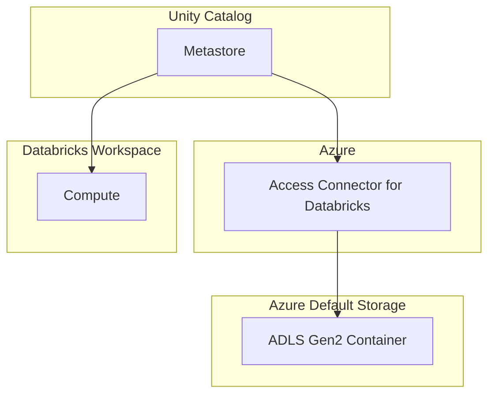

# learn-azure-databricks

## Core Concepts
### Spark
- At the core is RDD ( Resilient Distributed Datasets): a collection of items that can run in parallel in distributed systems
- Direct APIs are hard to code 
- Spark SQL Engine - Simplifies interaction with Spark easier
- Spark SQL - Collection of APIs for :
    - Streaming
    - ML
    - Graph
- Spark also comes with a standalone resource manager similar to YARN or Kubernetes

### Databricks
- Databricks provides ability to create Spark cluster easily with libraries for specific needs
- Provides Jupyter notebook for easier development
- Provides Admin Controls
- Optimized Spark runtime (5x faster)
- Ability create Database and Tables
- Delta Lake (Open Source) - Provides ACID capabilities
- SQL Analytics
- ML Flow

### Azure
- Can directly buy data bricks from azure instead of installing on a VM
- Unified portal, billing, security, single sign using Active Directory
- Integration with Power BI, Azure ML, Azure DevOps, DB
- Ingestion of data using Azure Data Factory

## Databricks Cluster Configuration
- Control Plane
    - Databricks cluster manager
    - Databricks UX
    - DBFS (not for actual data to be processed)
- Data Plane
    - Vnet
    -  Network Security Group (NSG)
    - Azure Blob Storage
    - Database Workspace
- Two types of clusters : All Purpose (Manual) | Job Clusters
    - **All Purpose cluster** : 
        - Created via the UI, CLI or API manually 
        - Can be reused and shared
        - Persistent and Expensive
    - **Job Cluster**:
        - Created by batch programs for automatic ETL or ML jobs. This is usually started from Workflows
        - Can’t be retained or shared. Starts and terminates with the required job purpose
        - Less expensive
- **Mode**:
    - Single Node : One node acting as driver and worker node, does not scale up horizontally 
    - Multi Node : Dedicated node for driver and worker nodes. Scales up as required
- **Access Mode**: 
    - Single User : One user access
    - Shared : multiple users can access but individual tasks are not shared, so one failure lets other users continue
    - No Isolation Shared : same as shared but process nodes are shared, so one failure blocks everyone
 
## How To
### Create Cluster and Create a Notebook
  - Creating standalone cluster takes about 5 minutes
  - Creating a pool earlier saves time in cluster start up
  - Workspace can be created if a cluster is running
  - Create a Workspace then create Notebook
 
### Magic Commands:
  - Use these commands to dynamically choose language and syntax in the notebook such as switching to SQL, FileSystems, Scala etc. while running in Python mode
  - Example: `%fs ls` to list files from the file system. `%scala print(msg)` is to compile a command using Scala language
  - Helps with adhoc queries 
 
### Databricks Utilities  
  - `dbutils.fs.ls('/some_dir')` - List files under some_dir
  - Useful with programmatic use of different methods


## Azure Data Lake
### Access to Data Lake Storage
1. **Using Access Keys** - Gives access to entire storage account
2. **Using SAS (Shared Access Signature) Tokens** - More granular control than Access keys. Limits access by type, resource, time, specific source IP address 
3. **Using Service Principal** - 
4. **Using Cluster Scoped Auth** - All the above types of auth can be done using cluster level config, so any notebook in the cluster can access storage account and the contents
5. **Using Unity Catalog** - 

## How to 
### Create Azure Data Lake Storage
1. Follow the steps to Create **Azure Storage Account First** : Create Resource > Storage Account > Create
2. Choose: Pay As You Go , Choose resource group for the project, name the storage account name unique, Local Redundancy is fine for tutorial, Performance : Standard
3. Ensure choosing Enable Hierarchical namespace. This helps in organizing storage for Data Lake
4. Leave deafult option for other tabs
5. Create folders to contain the data. This is known as the name `Container`. Create Three folders : `raw`, `processed` and `presentation`

### Use Azure Storage Explorer to Interact with Storage (Optional but Recommended)
1. Download Azure Storage Explorer From the `Storage Browser` from the Storage account created from the above steps

### Databricks Accessing Azure File Storage using Access Key
1. Azure File storage as an Access Key that Databricks can use to access
2. Example of Databricks authenticating into file system using access key :
   ```python
   sparks.conf.set("fs.azure.account.key.[storage_account].dfs.core.windows.net","[access_key]")
   ```
4. Azure expects Databricks to use `abfs` protocol abfs stands for **Azure Blob File System**
5. Example File path :
   ```python
   dbutils.fs.ls("abfss://[container_name]@[storage_account].dfs.core.windows.net/[folder]/[file_name]")
   ```

### Databricks Accessing Azure File Storage using SAS Token
1. Databricks authenticates and retrieves a SAS type of token [Microsoft Documentation](https://learn.microsoft.com/en-us/azure/databricks/connect/storage/azure-storage#sastokens)
2. SAS token can be created by going to the exact folder in Azure Storage account and via menu Create SAS Token. It allows access type, timeframe etc.

## Manage Secrets using Azure Key Vault 
1. Add secrets key/ values to **Azure Key Vault**
2. Link these secret values to Databrics by creating **Databricks Secret Scope**
    - URL to create databricks secret scope is on the workspace page add the following at the end : `<workspace_url>/secrets/createScope`
3. Get secrets in the Notebooks by using databricks util package - `dbutils.secrets.get`

---
# Data Governance
## Unity Catalog
- Unity Catalog centralizes user management and Metastore instead of each workspace has its own **User Management** system and **Hive Metastore**. Thus the workspace(s) have only to manage the computing resources. In addition, Unity Catalog Metastore has advantage over legacy hive metadata by providing features such as Data lineage, Audit, Data Explore
- A Metastore should be created one per region for high performance
- Data Access Control : Allow access as necessary 
- Data Audit : Log data access activities
- Data Lineage : Manage the journey and transformation of data
- Data Discoverability : Create a schema of data, so it can easily be found as required
- More Info - [Databricks Documentation](https://docs.databricks.com/en/data-governance/unity-catalog/index.html)

### Configuration

- Databricks Unity Catalog has Metastore component that uses storage inside Databricks Control Plane for storing all the catalog info. However the Metastore can connect to Azure Data Storage to store any other managed tables. This **recommended** approach to connect to Data Storage is via **Access Connector for Databricks** provided by Azure

### How to Create
1. Create **Azure Databricks Workspace** (premium tier) - Create this using Azure Portal GUI
2. Create **Azure Data Lake Storage Account** - Create this using Azure Portal GUI
3. Create **Azure Access Connector for Databricks** - Create this using Azure Portal GUI
4. Assign role of **Storage Blob Data Contributor** to **Access Connector** - Go to the the Storage Account > Access Control > Add Role Assignment > `Storage Blob Data Contributor` > Assign Access to : Managed Identity > Select Members > Access Connector > Select the one created in Step 3 above. Verify role assignment after creation. 
5. Create **Unity Catalog Metastore** - Navigate to Databricks Accounts at: https://accounts.azuredatabricks.net/ > Catalog > Create **Metastore** > Enter container name of the azure container created ADLS Gen2 path in the format : `[container_name]@[storage_account].dfs.core.windows.net/`
6. Attach **Databricks Workspace** to **Metastore**

## Cluster Configuration with Unity Catalog
- Create cluster from Databricks Workspace as usual. Once unity catalog is attached to a workspace, it should show under the summary to confirm that the cluster supports Unity Catalog
