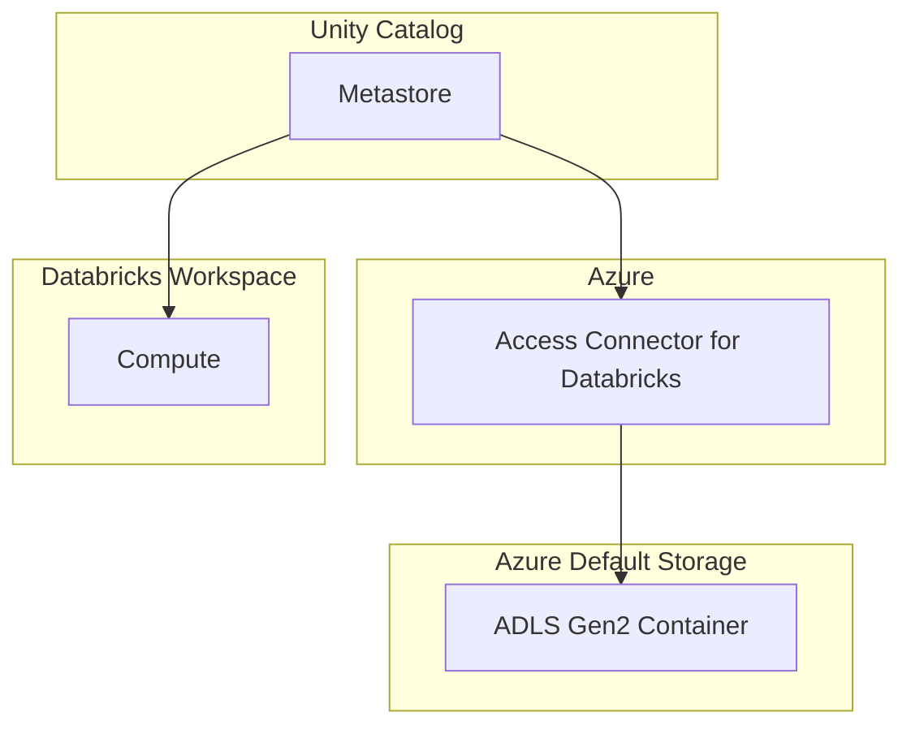

## Unity Catalog
- Unity Catalog centralizes user management and Metastore instead of each workspace has its own **User Management** system and **Hive Metastore**. Thus the workspace(s) have only to manage the computing resources. In addition, Unity Catalog Metastore has advantage over legacy hive metadata by providing features such as Data lineage, Audit, Data Explore
- A Metastore should be created one per region for high performance
- Data Access Control : Allow access as necessary 
- Data Audit : Log data access activities
- Data Lineage : Manage the journey and transformation of data
- Data Discoverability : Create a schema of data, so it can easily be found as required
- More Info - [Databricks Documentation](https://docs.databricks.com/en/data-governance/unity-catalog/index.html)

### Structure
- Unity catalog stores data in 3 level hierarchy
    - Catalog
        - Schema
            - Tables
- There are two ways to manage data
    - Databricks managed tables - Table and Data reside in the default storage account attached Databricks workspace
    - External Data source - Only table definition stays in Unity catalog, data stays in another storage account
 
      
### Configuration

- Databricks Unity Catalog has Metastore component that uses storage inside Databricks Control Plane for storing all the catalog info. However the Metastore can connect to Azure Data Storage to store any other managed tables. This **recommended** approach to connect to Data Storage is via **Access Connector for Databricks** provided by Azure

### How to Create
1. Create **Azure Databricks Workspace** (premium tier) - Create this using Azure Portal GUI
2. Create **Azure Data Lake Storage Account** - Create this using Azure Portal GUI
3. Create **Azure Access Connector for Databricks** - Create this using Azure Portal GUI
4. Assign role of **Storage Blob Data Contributor** to **Access Connector** - Go to the the Storage Account > Access Control > Add Role Assignment > `Storage Blob Data Contributor` > Assign Access to : Managed Identity > Select Members > Access Connector > Select the one created in Step 3 above. Verify role assignment after creation. 
5. Create **Unity Catalog Metastore** - Navigate to Databricks Accounts at: https://accounts.azuredatabricks.net/ > Catalog > Create **Metastore** > Enter container name of the azure container created ADLS Gen2 path in the format : `[container_name]@[storage_account].dfs.core.windows.net/`
6. Attach **Databricks Workspace** to **Metastore**

## Cluster Configuration with Unity Catalog
- Create cluster from Databricks Workspace as usual. Once unity catalog is attached to a workspace, it should show under the summary to confirm that the cluster supports Unity Catalog

## Integration with External Data Lake 
- The key difference between Databricks managed data lake is that Databricks houses the data in the default storage account attached with Databricks. And data bricks has more granular control on the data. In case of external location Unity Catalog has access to Data definition, but does not provide Data Lineage option. However the **external location is preferred** since Data Lineage is possible externally, and external location have more controls by the organization on how to secure and control access instead of letting Databricks take full control of the data.

### Steps to configure External Data Lake from Databricks
1. Create **Access Connector** in Azure
2. Create **Storage Account** in Azure to be the location where the external data lake data resides
3. Add **Storage Blob Data Contributor Role** from Azure IAM on the storage account created in Step 2 to the Access Connector created in Step 1
4. Create **Storage Credential** in Databricks using the Access Connector Info
5. Create **External Location** in Databricks

